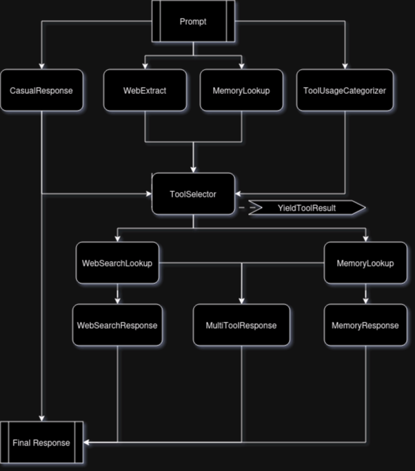

# Tim's RAGged System

> Tim's Agent Graph Building Framework

This system constructs a graph of nodes and the traverses the graph.
All nodes that can be parralelized are executed in parallel.

Edges of the graph can be toggeled based on node results, and nodes can also be toggled based on their parents results.

## Graph

Rougly this diagram presents the agents structure.
Nodes are executed in parallel, and edges are toggled based on node results.

- Agent graph definition [can be found here](system/rag/agents/hal9004_rag.py)



## Contraints

This agent used `openai` python client **BUT** is also compabible with e.g.: self hostend localai.io models or other API's that support the openai API-shema.
Current developent is experimental, but this system is intended to become the back-bone for [open-chat](https://github.com/msgmate-io/open-chat/) communication agents.

## Hal 9004 Agent

This framework currently implements one RAG agent `hal9004_rag`, that can do internet search and meomory retrival.

### Usage:

Set .env

```bash
DEEPINFRA_API_KEY="..."
OPENAI_API_KEY="..."
```

Query the agent:

```bash
python3 -m venv venv # (once only)
source venv/bin/activate
pip install -r requirements.txt # (once only)
# E.g.: trying to trigger a 'casual' resonse
env $(cat .env | xargs) python3 -u system/run_agent.py -p "How are you doing"
# E.g.: trigger a 'web_search' response
env $(cat .env | xargs) python3 -u system/run_agent.py -p "How is the weather in Aachen Today?"
# E.g.: Trigger a 'memory'-lookup response
env $(cat .env | xargs) python3 -u system/run_agent.py -p "Do you remember the name of the cool guitar player I told you about?"
```